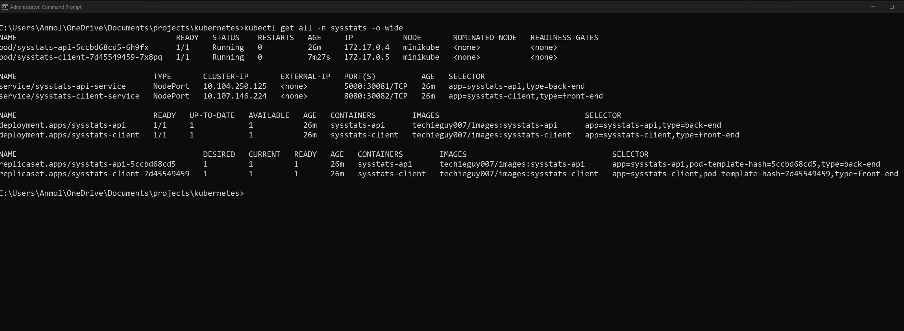
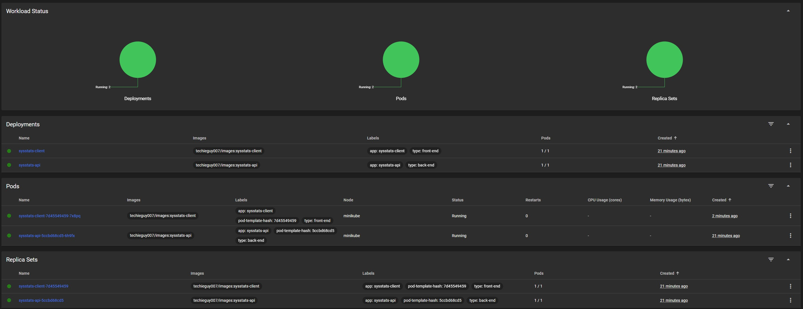
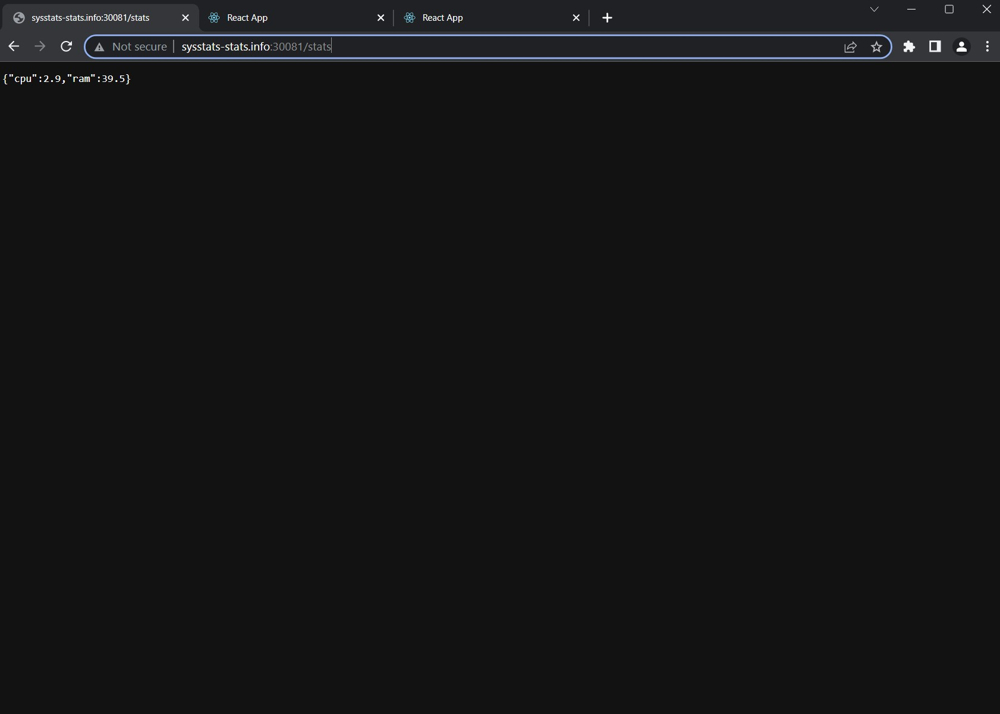
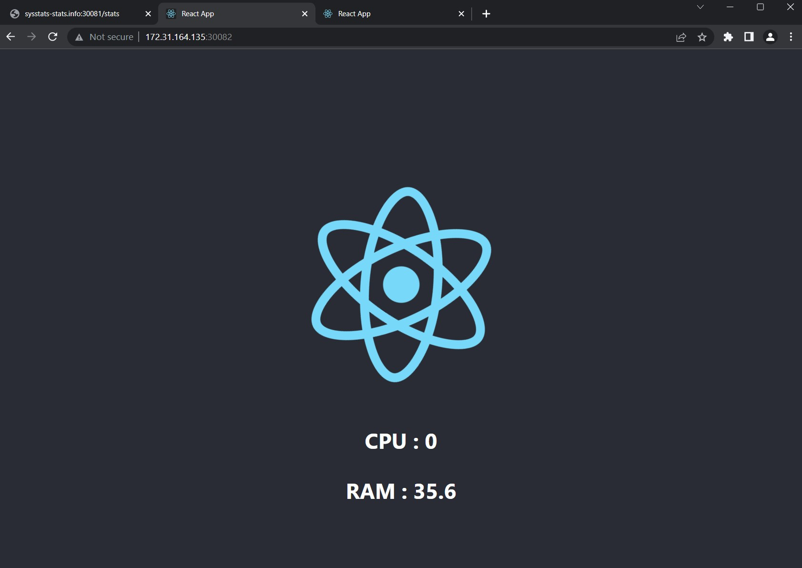
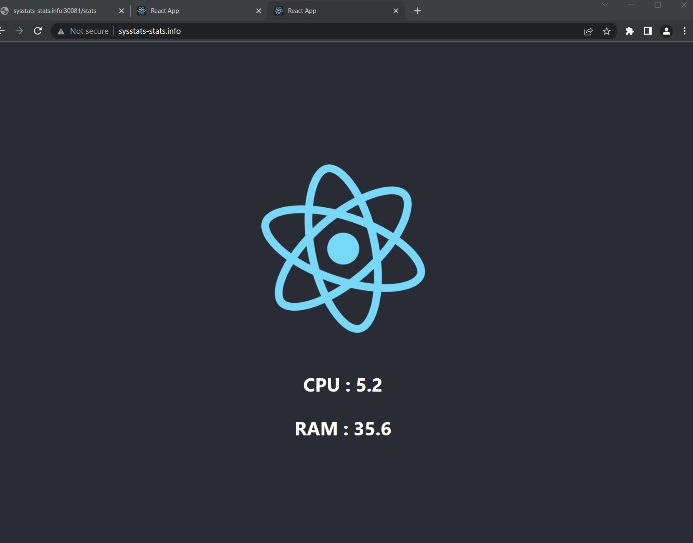

We have a simple Python - Flask Web App, which reads the current RAM and CPU usage and a React frontend which shows the statistics in the browser.

We will get it to work with Kubernetes , in few simple steps

`Build the images for frontend and backend using docker-compose`

```bash
docker-compose build
```

`Tag the images`

```bash
docker tag sysstats-client techieguy007/images:sysstats-client
docker tag sysstats-api techieguy007/images:sysstats-api
```

`Push these images to docker hub`

```bash
docker push techieguy007/images:sysstats-client
docker push techieguy007/images:sysstats-api
```

! The images need to tagged as we will pull them while deploying k8s from their tag.

`DEPLOYMENT STEPS ON kUBERNETES`

I have used minikube on Windows 11 OS with Hyper-V platform

`Start minikube`

```bash
miniKube start
```

`Get minikube ip`

```bash
miniKube ip
```

```
172.31.164.135
```

This ip needs to point to the host sysstats-stats.info in /etc/hosts file.
(dns flush and reregister might be required )
sysstats-stats.info is the same host that is pointed to in App.js file.

`Deploy frontend , backend services and ingress one by one, the namespace used is sysstats`

```bash
kubectl apply -f manifests/api.yml -n sysstats
```

```bash
kubectl apply -f manifests/client.yml -n sysstats
```

```bash
kubectl apply -f manifests/ingress.yml -n sysstats
```

`Verify the deployment`

```bash
kubectl get all -n sysstats -o wide
```



`Access the minikube dashboard to see the pods and services`

```bash
miniKube dashboard
```



`Access the endpoints for frontend and backend`

```bash
minikube service sysstats-api-service -n sysstats --url
```

```
http://172.31.164.135:30081
```



```bash
minikube service sysstats-client-service -n sysstats --url
```

```
http://172.31.164.135:30082
```



`Verified above that the endpoints are working`

`Enable the Ingress addon`

```bash
minikube addons enable ingress
```

`Now access the application using the ingress host`

```
http://sysstats-stats.info
```


